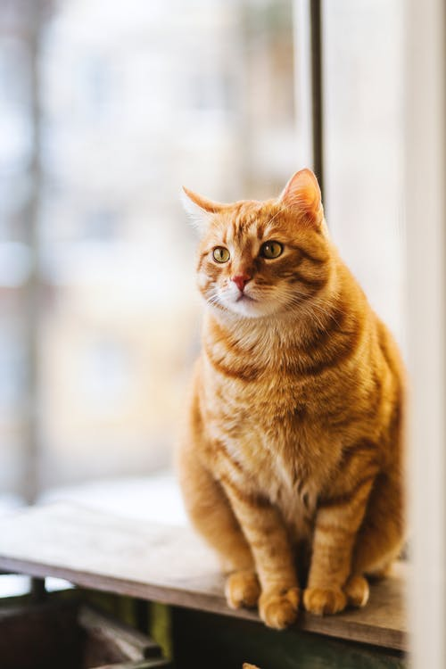

# This is Katie's awesome website  
hahaha this is fun 

# Let's add some links 

I often use [google](https://google.com) to do **data science**. 

An important feature of websites is hyperlinks. The general format for links is [text for link](address.of.link). So here's an example: 

I feel like I spend too much time watching videos on [that one video-sharing site](https://youtube.com). 

# Let's add an image

To add images and pictures I've found on the internet, I need to use a line of html. Let's see if this works: 

Here's a picture of a cute cat: 

Here's another cute cat: 

# Connecting other pages 

I am going to try and connect my 'about page' here. So I need to make a link to it from my home page or else no one will be able to find it. Here goes: 

To learn more about me, go to my [about](about.html) page! 

